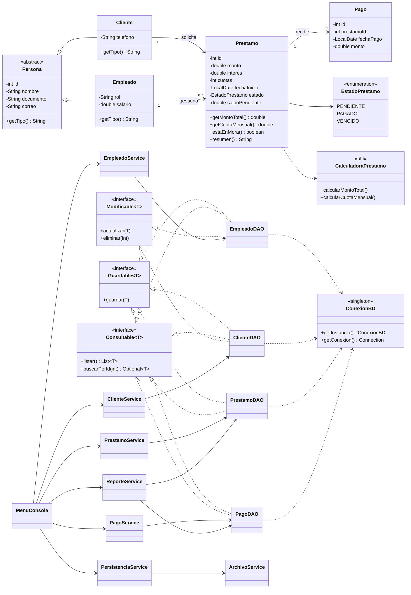

# Sistema de Cobros de Cartera — CrediYa S.A.S.

## 1. Nombre del proyecto
**Sistema de Cobros de Cartera CrediYa**, aplicación de consola en Java para la empresa ficticia CrediYa S.A.S.

## 2. Descripción
CrediYa otorga créditos personales y hasta ahora llevaba todo en hojas de cálculo. Este sistema permite registrar **empleados y clientes**, crear **préstamos** (con cálculo automático de interés y cuota), registrar **pagos y abonos** (el saldo se actualiza solo y el préstamo pasa a `PAGADO` cuando llega a cero) y generar **reportes** de la cartera.

## 3. Objetivo
Practicar Java, Programación Orientada a Objetos, JDBC directo (sin frameworks), colecciones, archivos, excepciones, Lambda/Stream API, SOLID y patrones de diseño.

## 4. Tecnologías
Java 17 · Maven · MySQL 8 · JDBC (MySQL Connector/J 8.4.0) · Apache NetBeans.

## 5. Requisitos
- JDK 17 instalado.
- MySQL Server 8.x en ejecución (puerto 3306) y MySQL Workbench (opcional).
- Apache NetBeans 17 o superior (trae Maven integrado).
- Conexión a internet la primera vez (Maven descarga el driver de MySQL).

## 6. Instalación
1. Descomprima `CrediYa.zip`.
2. En NetBeans: **File → Open Project…** y seleccione la carpeta `CrediYa` (el ícono debe aparecer como proyecto Maven).
3. Clic derecho sobre el proyecto → **Build** (la primera vez descarga el driver).

## 7. Configuración de MySQL
1. Abra MySQL Workbench (o la consola `mysql -u root -p`).
2. Ejecute completo `sql/crediya_db.sql` (crea `crediya_db` y las 4 tablas).
3. *(Opcional)* Ejecute `sql/datos_prueba.sql` para tener 2 empleados, 2 clientes, 3 préstamos y 7 pagos de ejemplo. Debe ejecutarse sobre tablas vacías.

Ajustes hechos al script original: `documento` único en empleados y clientes, columnas `NOT NULL`, nueva columna `prestamos.saldo_pendiente` y `pagos.monto` con `DECIMAL(12,2)`.

## 8. Configuración de credenciales
Edite `src/main/resources/db.properties`:

```properties
db.host=localhost
db.port=3306
db.name=crediya_db
db.user=root
db.password=SU_CONTRASEÑA
```
No suba su contraseña real a GitHub.

## 9. Ejecución
- **NetBeans:** clic derecho sobre el proyecto → **Run** (la clase principal es `com.crediya.Main`). Escriba las opciones en la ventana *Output*.
- **Terminal:** `mvn compile exec:java` desde la carpeta del proyecto.
- Si las tildes salen mal en Windows: Project Properties → Run → VM Options → `-Dfile.encoding=UTF-8`.

Al iniciar, el programa prueba la conexión y muestra `[OK] Conexión a MySQL establecida.` o un mensaje explicando qué falló.

## 10. Estructura del proyecto
```text
CrediYa
├── pom.xml
├── README.md
├── sql/            crediya_db.sql · datos_prueba.sql
├── docs/           diagrama-uml.mermaid
├── datos/          empleados.txt · clientes.txt · prestamos.txt · pagos.txt (generados)
└── src/main
    ├── resources/db.properties
    └── java/com/crediya
        ├── Main.java
        ├── modelo/          Persona, Cliente, Empleado, Prestamo, Pago, EstadoPrestamo
        ├── dao/             Guardable, Consultable, Modificable, EmpleadoDAO, ClienteDAO, PrestamoDAO, PagoDAO
        ├── servicio/        EmpleadoService, ClienteService, PrestamoService, PagoService, ReporteService, PersistenciaService
        ├── persistencia/    ConexionBD, ArchivoService
        ├── excepciones/     CrediYaException (base) y 6 hijas
        ├── util/            Validaciones, CalculadoraPrestamo, Formato
        └── vista/           MenuConsola
```

## 11. Módulos
| Módulo | Qué hace |
|---|---|
| Empleados | Registrar, listar, buscar (ID o documento), actualizar, eliminar (si no tiene préstamos) |
| Clientes | Igual que empleados + consultar sus préstamos |
| Préstamos | Crear con cálculo automático, listar, buscar, activos, pagados, cambiar estado |
| Pagos | Registrar abonos, consultar pagos, histórico por préstamo, saldo |
| Reportes | 7 reportes + filtros (estado, cliente, empleado, rango de monto, saldo) |
| Persistencia | Exportar a `.txt`, importar empleados/clientes, ver archivos, cargar datos de prueba, probar conexión |

**Regla de mora:** cada mes transcurrido desde la fecha de inicio vence una cuota. Un préstamo está en mora si lo pagado es menor a lo que ya debía estar pagado (cuotas vencidas × cuota mensual), o si fue marcado manualmente como `VENCIDO`.

**Persistencia dual:** MySQL es la fuente principal de datos. Los archivos `.txt` sirven como respaldo/exportación; se pueden importar empleados y clientes de vuelta a MySQL.

## 12. Ejemplos de uso
Préstamo de $2.000.000 al 10 % en 10 cuotas:
```text
Monto solicitado: $2.000.000
Interés: 10%
Valor interés: $200.000
Monto total: $2.200.000
Número de cuotas: 10
Cuota mensual: $220.000
Saldo pendiente: $2.200.000
Estado: PENDIENTE
```
Pago de $220.000:
```text
Saldo anterior: $2.200.000
Pago: $220.000
Saldo actual: $1.980.000
Estado: PENDIENTE
```
Pago que supera el saldo:
```text
[ERROR] El pago de $2.000.000 supera el saldo pendiente de $1.980.000. Pago rechazado.
```

## 13. Patrones de diseño utilizados
- **DAO:** `EmpleadoDAO`, `ClienteDAO`, `PrestamoDAO` y `PagoDAO` encierran todo el SQL. Si mañana se cambia MySQL por otra base, solo cambian los DAO.
- **Singleton:** `ConexionBD` tiene una única instancia que lee `db.properties` una sola vez. Cada `getConexion()` abre una `Connection` nueva que el DAO cierra con try-with-resources (lo único compartido es la configuración).

## 14. Principios SOLID aplicados
- **S:** cada clase hace una cosa (`CalculadoraPrestamo` solo calcula, `ArchivoService` solo lee/escribe archivos, `MenuConsola` solo interactúa).
- **O:** para un reporte nuevo se agrega un método en `ReporteService` sin tocar los existentes.
- **L:** `Cliente` y `Empleado` se usan como `Persona` sin romper nada (`getTipo()` es polimórfico).
- **I:** interfaces pequeñas `Guardable`, `Consultable`, `Modificable`; `PagoDAO` no está obligado a implementar `eliminar`.
- **D:** la lógica de negocio no contiene SQL; delega en los DAO, que se reciben por constructor desde `Main`. (Los servicios reciben DAO concretos por sencillez; el siguiente paso sería depender de las interfaces.)

## 15. Manejo de excepciones
Todas heredan de `CrediYaException`: `ClienteNoEncontradoException`, `EmpleadoNoEncontradoException`, `PrestamoNoEncontradoException`, `PagoInvalidoException`, `DatosInvalidosException` y `ErrorPersistenciaException` (envuelve `SQLException` e `IOException`). `MenuConsola.ejecutar(...)` las captura y muestra `[ERROR] mensaje`, así el programa no se cierra por errores controlables.

## Diagrama UML de clases principales


## PRUEBA DEL SISTEMA
Con la base creada (`sql/crediya_db.sql`) y `db.properties` configurado, ejecute el programa y siga estos pasos (los números son las opciones del menú):

1. **Registrar empleado:** `1` → `1` → Juan Pérez / 123456789 / Asesor / juan@crediya.com / 2500000 → `0`.
2. **Registrar cliente:** `2` → `1` → Carlos Gómez / 1098765432 / carlos@gmail.com / 3001234567 → `0`.
3. **Crear préstamo:** `3` → `1` → cliente `1`, empleado `1`, monto `2000000`, interés `10`, cuotas `10`, Enter para fecha de hoy. Verifique: interés $200.000, total $2.200.000, cuota $220.000, estado PENDIENTE.
4. **Registrar pago:** `0` → `4` → `1` → préstamo `1`, monto `220000`. Verifique saldo actual $1.980.000.
5. **Consultar saldo:** en Pagos `4` → préstamo `1` → $1.980.000.
6. **Consultar histórico:** en Pagos `3` → préstamo `1` → muestra el pago y el total pagado.
7. **Probar el rechazo:** `1` → préstamo `1`, monto `2000000` → mensaje de error y el saldo no cambia.
8. **Reportes:** menú `5` → opciones `1` a `7` (más `8` para filtros).
9. **Llegar a PAGADO:** registre un pago de `1980000` en el préstamo 1 → saldo $0 y estado **PAGADO**. Confirme en Préstamos → `5` (pagados) y Reportes → `2`.
10. **Archivos:** menú `6` → `1` (exportar) y `3` (ver contenido). Se crea la carpeta `datos/`.

Con `sql/datos_prueba.sql`, el reporte de morosos muestra a Carlos Gómez (préstamo 1 atrasado), el total de cartera es $3.080.000 y el total de pagos $770.000.

## Errores comunes de conexión JDBC
| Mensaje | Causa y solución |
|---|---|
| `Usuario o contraseña de MySQL incorrectos` | Revise `db.user` y `db.password` en `db.properties`. |
| `La base de datos no existe` | Ejecute `sql/crediya_db.sql`. |
| `No se pudo conectar con MySQL` | El servicio MySQL está apagado o el puerto es otro. En Windows: *Servicios → MySQL80 → Iniciar*. |
| `No se encontró el driver` | Clic derecho al proyecto → *Clean and Build* con internet; verifique la dependencia en `pom.xml`. |
| `No se encontró db.properties` | Debe estar en `src/main/resources/`; haga *Clean and Build*. |
| Tildes con `?` o símbolos raros | Use `-Dfile.encoding=UTF-8` en VM Options. |
